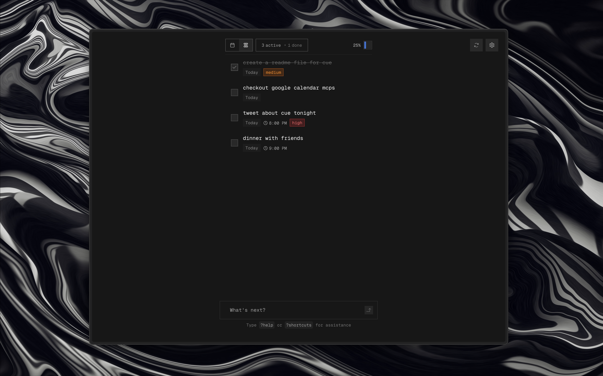

# Cue

<p align="center">
  
</p>

A minimalist AI-powered task manager that intuitively processes natural language to organize your day. Simply type what you need, and let AI handle the rest.

## Features

- AI-powered task intelligence: Create, edit, schedule, prioritize, sort, and complete tasks using natural language
- Privacy-focused with local storage (IndexedDB)
- PWA with offline support
- Minimalistic dark themed UI
- Keyboard shortcuts
- Swipe gestures on mobile
- Device sync via JSON export/import
- Customizable settings
- Secure authentication with Clerk (Optional)
- Google Calendar integration for task sync and notifications (Optional)

## Tech Stack

- **Framework**: [Next.js](https://nextjs.org/)
- **AI Models**: Claude, Llama, Grok, Qwen via [ai-sdk](https://github.com/vercel/ai)
- **UI**: [TailwindCSS](https://tailwindcss.com/)
- **State**: Local with [IndexedDB](https://dexie.org/)
- **Animations**: [Framer Motion](https://www.framer.com/motion/)
- **Date Handling**: [date-fns](https://date-fns.org/)

## AI Capabilities

Cue understands natural language commands for task management:

- **Intelligent Creation**: "Add team meeting tomorrow at 3pm with high priority"
- **Smart Editing**: "Move my dentist appointment to Friday at 2pm"
- **Quick Actions**: "Mark gym session as complete" or "Delete yesterday's tasks"
- **Bulk Processing**: "Add buy groceries today and schedule dentist for next Friday"
- **Time Understanding**: Automatically converts time references (2pm, morning, etc.)
- **Date Parsing**: Handles relative dates (today, tomorrow, next week)
- **Priority Recognition**: Identifies importance levels from your language

## Getting Started

```bash
# Install dependencies
pnpm install

# Copy environment variables
cp .env.example .env.local

# Start development server
pnpm run dev
```

## Authentication & Calendar Integration (Optional)

Cue uses Clerk for secure authentication and Google Calendar integration:

- **Secure Sign-in**: Sign in with your Google account through Clerk
- **Calendar Sync**: Automatically sync your tasks with Google Calendar
- **Smart Notifications**: Get timely reminders for your tasks through Google Calendar
- **Privacy First**: Your calendar data is only accessed with your explicit permission

To enable Google Calendar integration:
1. Sign in with your Google account
2. Grant calendar access permissions when prompted
3. Your tasks will automatically sync with your calendar
4. Configure notification preferences in your settings

## Development

```bash
# Lint code
pnpm run lint

# Type check
pnpm run tc

# Build for production
pnpm run build
```

## License

MIT